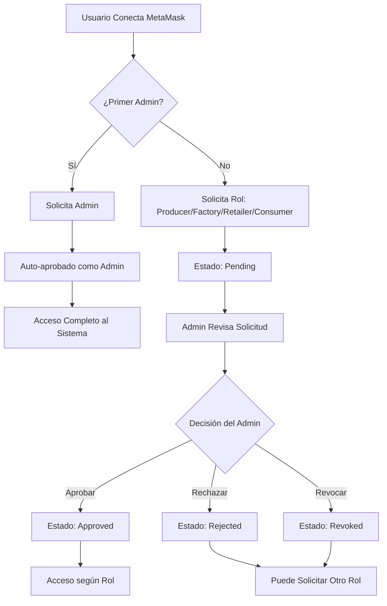
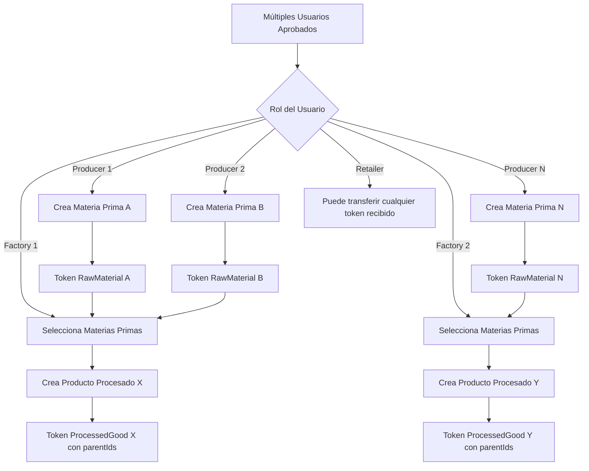
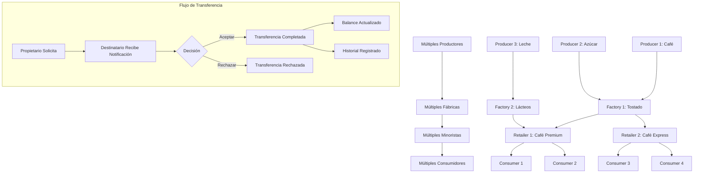
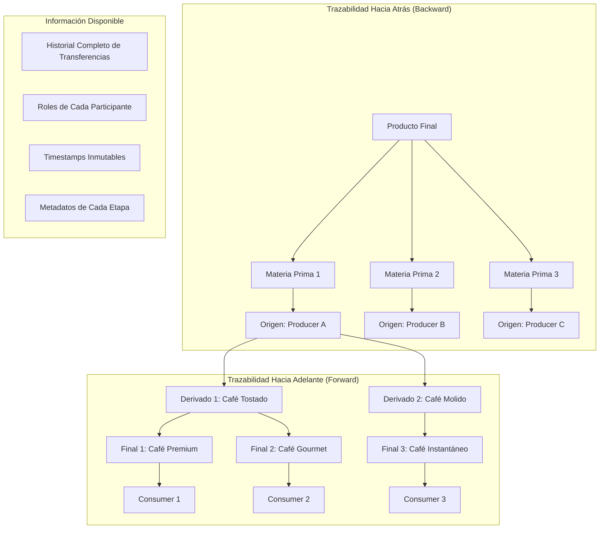
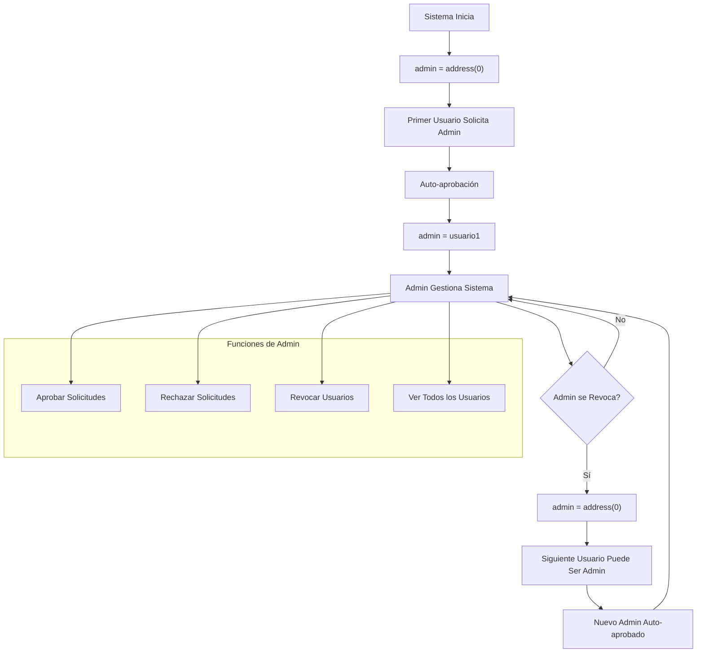

# 🔗 Trazabilidad de Productos con Blockchain

**Proyecto de Ricardo Vögeli – GitHub: [@risuiar](https://github.com/risuiar)**  
**Sitio:** <codecrypto.academy/>

Aplicación descentralizada para rastrear productos desde su origen hasta el consumidor final, garantizando transparencia y trazabilidad completa en toda la cadena de suministro.

## 📖 ¿Qué hace esta aplicación?

Permite que diferentes actores de una cadena de suministro (productores, fábricas, minoristas y consumidores) registren y transfieran productos de forma transparente usando tecnología blockchain. Cada producto tiene un historial completo e inmutable que puede ser verificado por cualquier persona.

### 🎯 Roles en la Cadena

| Rol | Descripción | Puede Hacer |
|-----|-------------|-------------|
| **🌾 Productor** | Origen de materias primas | Crear materias primas y enviar a fábricas |
| **🏭 Fábrica** | Procesa materias primas | Transformar materias primas en productos y enviar a minoristas |
| **🏪 Minorista** | Distribuye productos | Recibir productos y distribuir a consumidores |
| **🛒 Consumidor** | Usuario final | Recibir y verificar productos finales |
| **👨‍💼 Administrador** | Gestiona el sistema | Aprobar/rechazar solicitudes de roles y revocar accesos |

## ✨ Funcionalidades Principales

### 🆕 Sistema de Roles con Control Total

- **Solicitud de Roles**: Cualquier usuario puede solicitar un rol en el sistema
- **Múltiples Usuarios por Rol**: Soporte para múltiples productores, fábricas, minoristas y consumidores
- **Admin Dinámico**: El primer usuario en solicitar Admin se convierte en administrador
- **Gestión Independiente**: Los usuarios pueden cancelar sus propias solicitudes pendientes
- **Validaciones Inteligentes**: 
  - No puedes solicitar otro rol si ya tienes uno aprobado
  - No puedes hacer solicitudes duplicadas
  - Solo el administrador puede aprobar/rechazar
- **Panel de Administración**: Gestión completa de solicitudes y usuarios
- **Actualizaciones en Tiempo Real**: Los cambios se reflejan automáticamente en la interfaz

### 📦 Gestión de Productos con Trazabilidad Completa

- **Creación de Productos**: Cada producto es un token con información detallada
- **Trazabilidad Bidireccional**: 
  - **Hacia atrás**: Desde cualquier producto hasta sus materias primas originales
  - **Hacia adelante**: Desde materias primas hasta todos los productos derivados
- **Metadatos Flexibles**: Guarda información personalizada de cada producto
- **Relaciones de Parentesco**: Los productos procesados mantienen referencia completa a sus materias primas
- **Historial Inmutable**: Cada movimiento queda registrado permanentemente

### 🔄 Sistema de Transferencias Inteligente

- **Solicitud de Transferencia**: Envía productos a otros actores
- **Aprobación Requerida**: El receptor debe aceptar la transferencia
- **Control de Roles Estricto**: Solo se pueden hacer transferencias válidas según tu rol
- **Flujo Dirigido**: Producer → Factory → Retailer → Consumer
- **Seguimiento Completo**: Ve todas tus transferencias pendientes y completadas
- **Validaciones de Negocio**: Solo el creador puede transferir sus productos (Producer/Factory)

### 🛡️ Seguridad y Transparencia

- **Blockchain Inmutable**: Ningún dato puede ser alterado una vez registrado
- **Smart Contracts Auditables**: Código verificable y transparente
- **Permisos Granulares**: Cada rol tiene permisos específicos y limitados
- **Sin Intermediarios**: Las transacciones son directas entre las partes
- **Eventos Completos**: Todos los cambios emiten eventos para trazabilidad

### 🔐 Autenticación y Persistencia de Sesión

- **Conexión con MetaMask**: Integración completa con MetaMask para autenticación Web3
- **Persistencia en localStorage**: La sesión se mantiene al recargar la página
  - Tu conexión se guarda automáticamente cuando conectas tu wallet
  - Al recargar, la aplicación restaura tu sesión si la cuenta sigue disponible en MetaMask
- **Desconexión Limpia**: Al desconectar, todos los datos se eliminan del localStorage
- **Detección Automática de Cambios**: 
  - Si cambias de cuenta en MetaMask, la aplicación se actualiza automáticamente
  - Si desconectas en MetaMask, la aplicación también se desconecta
  - Cambios de red detectados y manejo automático

## 🔄 Flujos de Trabajo Mejorados

### 1. **Registro de Usuario (Soporte Múltiple)**



### 2. **Creación de Token con Múltiples Productores**



### 3. **Transferencia en Cadena Multi-Actor**



### 4. **Trazabilidad Completa (Bidireccional)**



### 5. **Gestión de Admin Dinámico**



## 🚀 Inicio Rápido

### Requisitos Previos

- **Node.js** v18 o superior ([Descargar](https://nodejs.org/))
- **Foundry** (herramientas blockchain) ([Instalación](https://book.getfoundry.sh/getting-started/installation))
- **MetaMask** (extensión de navegador) ([Descargar](https://metamask.io/))

### Instalación

```bash
# 1. Clonar el repositorio
git clone <repo-url>
cd supply-chain-tracker

# 2. Instalar dependencias del frontend
cd web
npm install
cd ..
```

### Ejecutar la Aplicación

#### Paso 1: Iniciar Blockchain Local

En una terminal:

```bash
anvil
```

✅ Debe mostrar: `Listening on 127.0.0.1:8545`

**⚠️ IMPORTANTE: Deja esta terminal abierta todo el tiempo**

#### Paso 2: Desplegar Contratos

En otra terminal:

**En Windows:**
```bash
deploy-windows.bat
```

**En Mac/Linux:**
```bash
./deploy-mac.sh
```

*(La primera vez en Mac/Linux ejecuta: `chmod +x deploy-mac.sh`)*

O manualmente:

```bash
cd sc
forge script script/DeploySupplyChainSystem.s.sol:DeploySupplyChain \
  --rpc-url http://localhost:8545 \
  --private-key 0xac0974bec39a17e36ba4a6b4d238ff944bacb478cbed5efcae784d7bf4f2ff80 \
  --broadcast
```

**📝 Copia las 3 direcciones que aparecen:**

```
RoleManager:      0x5FbDB2315678afecb367f032d93F642f64180aa3
TokenFactory:     0xe7f1725E7734CE288F8367e1Bb143E90bb3F0512
TransferManager:  0x9fE46736679d2D9a65F0992F2272dE9f3c7fa6e0
```

#### Paso 2.1: Configurar Variables de Entorno

Crea o actualiza el archivo `web/.env` con la configuración de ambas redes:

```env
# Red activa: anvil o sepolia
VITE_NETWORK=anvil

# Direcciones para Anvil (red local)
VITE_ROLE_MANAGER_ADDRESS_ANVIL=0x5FbDB2315678afecb367f032d93F642f64180aa3
VITE_TOKEN_FACTORY_ADDRESS_ANVIL=0xe7f1725E7734CE288F8367e1Bb143E90bb3F0512
VITE_TRANSFER_MANAGER_ADDRESS_ANVIL=0x9fE46736679d2D9a65F0992F2272dE9f3c7fa6e0

# Direcciones para Sepolia (testnet)
# Actualiza estas después de desplegar en Sepolia
VITE_ROLE_MANAGER_ADDRESS_SEPOLIA=0x0000000000000000000000000000000000000000
VITE_TOKEN_FACTORY_ADDRESS_SEPOLIA=0x0000000000000000000000000000000000000000
VITE_TRANSFER_MANAGER_ADDRESS_SEPOLIA=0x0000000000000000000000000000000000000000
```

**💡 Tip:** Puedes copiar desde el template: `cp web/env.local.template web/.env`

#### Paso 2.2: Cambiar entre Redes (Anvil Local o Sepolia)

Para cambiar entre Anvil (local) y Sepolia (testnet), simplemente edita `web/.env` y cambia el flag:

```env
VITE_NETWORK=anvil    # Para desarrollo local
VITE_NETWORK=sepolia  # Para testnet
```

**💡 Ventaja:** 
- Un solo archivo `.env` con todas las configuraciones
- Solo cambias `VITE_NETWORK=anvil` o `VITE_NETWORK=sepolia`
- Al arrancar `npm run dev`, el servidor lee el `.env` y usa las direcciones correctas automáticamente

#### Paso 3: Iniciar Frontend

```bash
cd web
npm run dev
```

Abre en tu navegador: **http://localhost:5173**

### Configurar MetaMask

1. **Agregar Red Local**:
   - Nombre: Localhost 8545
   - RPC URL: `http://127.0.0.1:8545`
   - Chain ID: `31337`
   - Moneda: `ETH`

2. **Importar Cuenta para ser Admin**:
   - Private Key: `0xac0974bec39a17e36ba4a6b4d238ff944bacb478cbed5efcae784d7bf4f2ff80`
   - Dirección: `0xf39Fd6e51aad88F6F4ce6aB8827279cffFb92266`

## 🎮 Cómo Usar la Aplicación

### Para el Primer Usuario (Convertirse en Admin)

1. **Conecta tu Wallet** → Click en "Conectar MetaMask"
2. **Solicita rol Admin** → Selecciona "Administrador" (solo disponible si no hay admin)
3. **Auto-aprobación** → Te conviertes automáticamente en administrador
4. **Acceso Completo** → Serás redirigido al panel de administración

### Para Usuarios Nuevos

1. **Conecta tu Wallet** → Click en "Conectar MetaMask"
2. **Solicita un Rol** → Elige entre Productor, Fábrica, Minorista o Consumidor
3. **Espera Aprobación** → El administrador revisará tu solicitud
4. **Accede al Sistema** → Una vez aprobado, puedes usar todas las funciones

### Para el Administrador

1. **Revisa Solicitudes** → Ve todas las solicitudes pendientes en tiempo real
2. **Aprueba o Rechaza** → Click en los botones según corresponda
3. **Gestiona Usuarios** → Revoca accesos si es necesario
4. **Nota**: Si te revocas a ti mismo, pierdes permisos de admin y otro usuario puede convertirse en admin

### Crear tu Primer Producto (Como Productor o Fábrica)

1. Ve a **"Productos"** → Click en "Crear Producto"
2. Completa la información:
   - Nombre del producto (ej: "Café Premium")
   - Cantidad total (ej: 1000)
   - Metadatos opcionales (ej: origen, características)
3. Confirma la transacción en MetaMask
4. ¡Listo! Tu producto aparecerá en "Mis Productos"

### Transferir Productos

1. Ve a **"Productos"** → Selecciona un producto
2. Click en **"Transferir"**
3. Selecciona:
   - Destinatario (debe tener el rol correcto)
   - Cantidad a transferir
4. El destinatario debe **aceptar** la transferencia en su panel

### Ver Trazabilidad Completa

1. Ve a **"Productos"** → Selecciona cualquier producto
2. **Trazabilidad Hacia Atrás**: Ve todas las materias primas utilizadas hasta el origen
3. **Trazabilidad Hacia Adelante**: (Solo materias primas) Ve todos los productos derivados y su destino final
4. **Historial Completo**: Ve todas las transferencias con timestamps y roles

## 💡 Ventajas de Usar Blockchain

### Para Productores y Fabricantes

- ✅ **Certificación de Origen**: Prueba verificable del origen de tus productos
- ✅ **Protección de Marca**: Registro inmutable de tus productos
- ✅ **Trazabilidad Completa**: Sigue tus productos en toda la cadena
- ✅ **Visibilidad Forward**: Ve qué productos se crean con tus materias primas

### Para Minoristas

- ✅ **Verificación de Autenticidad**: Confirma el origen real de los productos
- ✅ **Transparencia**: Muestra la trazabilidad completa a tus clientes
- ✅ **Confianza**: Productos con historial verificable
- ✅ **Flexibilidad**: Puede manejar productos de múltiples fábricas

### Para Consumidores

- ✅ **Información Completa**: Ve el recorrido completo de tu producto
- ✅ **Garantía de Autenticidad**: Productos verificados en blockchain
- ✅ **Transparencia Total**: Información inmutable y verificable
- ✅ **Trazabilidad hasta el Origen**: Conoce exactamente de dónde viene tu producto

### Para Todos

- 🔒 **Seguridad**: Datos inmutables y a prueba de fraudes
- 🌐 **Descentralizado**: Sin intermediarios que controlen la información
- 📊 **Transparente**: Toda la información es verificable públicamente
- 💰 **Eficiente**: Reduce costos de verificación y auditorías
- 🏢 **Escalable**: Soporte para múltiples actores por rol

## 🔑 Cuentas de Prueba (Anvil)

Para pruebas locales, Anvil proporciona cuentas pre-financiadas. Usa estas para probar diferentes roles:

| Rol Sugerido | Dirección | Private Key |
|--------------|-----------|-------------|
| **Admin** | `0xf39Fd6e51aad88F6F4ce6aB8827279cffFb92266` | `0xac0974bec39a17e36ba4a6b4d238ff944bacb478cbed5efcae784d7bf4f2ff80` |
| **Productor** | `0x70997970C51812dc3A010C7d01b50e0d17dc79C8` | `0x59c6995e998f97a5a0044966f0945389dc9e86dae88c7a8412f4603b6b78690d` |
| **Fábrica** | `0x3C44CdDdB6a900fa2b585dd299e03d12FA4293BC` | `0x5de4111afa1a4b94908f83103eb1f1706367c2e68ca870fc3fb9a804cdab365a` |
| **Minorista** | `0x90F79bf6EB2c4f870365E785982E1f101E93b906` | `0x7c852118294e51e653712a81e05800f419141751be58f605c371e15141b007a6` |
| **Consumidor** | `0x15d34AAf54267DB7D7c367839AAf71A00a2C6A65` | `0x47e179ec197488593b187f80a00eb0da91f1b9d0b13f8733639f19c30a34926a` |

### Cómo Importar Cuentas en MetaMask

1. Abre MetaMask → Click en el ícono de cuenta (arriba derecha)
2. Click en **"Importar cuenta"** o **"Import Account"**
3. Pega la **Private Key** de la tabla
4. Click en **"Importar"**

### Cómo Cambiar de Cuenta

Tienes dos opciones para cambiar de cuenta:

**Opción 1: Cambio Automático**
1. Cambia a la cuenta deseada directamente en MetaMask
2. La aplicación detectará el cambio automáticamente y se actualizará

**Opción 2: Desconexión Manual**
1. Click en **"Desconectar"** en la aplicación
2. Cambia a la cuenta deseada en MetaMask
3. Click en **"Conectar MetaMask"** nuevamente

**💡 Nota sobre Persistencia:**
- Si recargas la página, tu sesión se restaurará automáticamente si la cuenta sigue disponible en MetaMask
- Al desconectar manualmente, la sesión no se restaurará al recargar (para mayor seguridad)

## 🐛 Problemas Comunes y Soluciones

### ❌ "Error: El contrato no está desplegado en esta red"

**Solución:**
1. Verifica que Anvil esté corriendo
2. Vuelve a desplegar los contratos:
   - Windows: `deploy-windows.bat`
   - Mac/Linux: `./deploy-mac.sh`
3. Actualiza las direcciones en `web/.env`
4. Reinicia el frontend (Ctrl+C y `npm run dev` de nuevo)

### ❌ "Ya tienes un rol aprobado"

**Explicación:** No puedes solicitar otro rol si ya tienes uno aprobado. Esto es por diseño para mantener la integridad de la cadena de suministro.

### ❌ "Ya tienes una solicitud pendiente"

**Solución:** Puedes cancelar tu solicitud pendiente usando el botón "Cancelar Solicitud" y luego solicitar otro rol.

### ❌ MetaMask no muestra las transacciones

**Solución:**
1. En MetaMask → Configuración → Avanzado
2. Click en "Clear activity tab data" o "Reset account"
3. Esto limpiará el cache de transacciones

### ❌ "Nonce too high"

**Solución:** Reset MetaMask (Configuración → Avanzado → Clear activity tab data)

## 🛠️ Tecnologías Utilizadas

- **Blockchain**: Solidity 0.8.20 con Foundry
- **Frontend**: React 18 + TypeScript + Vite
- **Estilos**: Tailwind CSS
- **Web3**: ethers.js v6
- **Notificaciones**: react-hot-toast

## 🌐 Deployment en Testnets (Sepolia, etc.)

> 💻 **Live Testnet Frontend:** La versión conectada a Sepolia está desplegada en un VPS propio y disponible en https://supply-chain-tracker-risuiar.travix.app. Usa la red Sepolia en MetaMask para interactuar con los contratos verificados.

Para desplegar en una red de prueba real en lugar de local:

### 1. Configurar Variables de Entorno

Crea un archivo `sc/.env` con tu configuración:

```env
SEPOLIA_RPC_URL=https://eth-sepolia.g.alchemy.com/v2/TU_ALCHEMY_KEY
PRIVATE_KEY=tu_private_key_sin_0x
ETHERSCAN_API_KEY=tu_api_key_opcional
```

**⚠️ Importante:**
- `PRIVATE_KEY` debe ser sin el prefijo `0x`
- Asegúrate de tener SepoliaETH en tu cuenta (usa un faucet: https://sepoliafaucet.com)
- `ETHERSCAN_API_KEY` es opcional, pero recomendado para verificar contratos

### 2. Desplegar en Sepolia

**En Windows:**
```bash
deploy-sepolia-windows.bat
```

**En Mac/Linux:**
```bash
chmod +x deploy-sepolia-mac.sh
./deploy-sepolia-mac.sh
```

Los scripts automáticamente:
- ✅ Verifican que existe `sc/.env`
- ✅ Cargan las variables de entorno
- ✅ Validan que las variables estén configuradas
- ✅ Despliegan los contratos en Sepolia
- ✅ Verifican los contratos en Etherscan (si tienes API key)

**📝 Copia las 3 direcciones que aparecen:**
```
RoleManager:      0x...
TokenFactory:     0x...
TransferManager:  0x...
```

### 3. Actualizar Frontend

Actualiza `web/.env` con las **nuevas direcciones de Sepolia**:

```env
# Cambia la red a sepolia
VITE_NETWORK=sepolia

# Actualiza las direcciones SEPOLIA (mantén las ANVIL también)
VITE_ROLE_MANAGER_ADDRESS_SEPOLIA=0x... # Dirección de Sepolia
VITE_TOKEN_FACTORY_ADDRESS_SEPOLIA=0x... # Dirección de Sepolia
VITE_TRANSFER_MANAGER_ADDRESS_SEPOLIA=0x... # Dirección de Sepolia
```

### 4. Configurar MetaMask

1. **Agregar Red Sepolia**:
   - Nombre: `Sepolia`
   - RPC URL: `https://eth-sepolia.g.alchemy.com/v2/TU_ALCHEMY_KEY` (o usa una pública)
   - Chain ID: `11155111`
   - Moneda: `ETH`

2. **Importar tu cuenta** (la que usaste para desplegar):
   - Esta será tu cuenta de administrador
   - Asegúrate de tener SepoliaETH (usa un faucet si necesitas)

3. **Conectar a la aplicación**:
   - Cambia a la red Sepolia en MetaMask
   - Conecta tu wallet en la aplicación

## 📚 Documentación Técnica

Para desarrolladores que quieran entender el código en detalle:

- **[README_SPECS.md](./README_SPECS.md)**: Especificaciones técnicas completas de los contratos, arquitectura y decisiones de diseño

## 🎯 Flujo de Prueba Completo Multi-Usuario

Sigue estos pasos para probar todas las funcionalidades con múltiples usuarios:

### 1. Configura el Sistema

1. **Inicia Anvil** → Terminal 1: `anvil`
2. **Despliega Contratos** → Terminal 2: Script según tu sistema operativo
3. **Actualiza Direcciones** → En `web/.env`
4. **Inicia Frontend** → Terminal 3: `cd web && npm run dev`

### 2. Como Primer Usuario (Admin)

1. **Conecta con cualquier cuenta** → Solicita rol "Administrador"
2. **Auto-aprobación** → Te conviertes automáticamente en admin
3. **Panel de Administración** → Acceso completo al sistema

### 3. Como Múltiples Productores (Cuentas 2, 3, 4)

1. **Productor A** (Cuenta 2):
   - Solicita rol "Productor" → Admin aprueba
   - Crea "Café Premium, 1000 unidades"
   - Crea "Azúcar Orgánica, 500 unidades"

2. **Productor B** (Cuenta 3):
   - Solicita rol "Productor" → Admin aprueba
   - Crea "Leche Fresca, 2000 litros"
   - Crea "Cacao Premium, 300 kg"

3. **Productor C** (Cuenta 4):
   - Solicita rol "Productor" → Admin aprueba
   - Crea "Vainilla Natural, 100 unidades"

### 4. Como Múltiples Fábricas (Cuentas 5, 6)

1. **Fábrica A** (Cuenta 5):
   - Solicita rol "Fábrica" → Admin aprueba
   - Recibe café y azúcar de Productores A
   - Crea "Café Endulzado Premium" usando ambas materias primas
   - **Trazabilidad**: El producto final muestra ambos orígenes

2. **Fábrica B** (Cuenta 6):
   - Solicita rol "Fábrica" → Admin aprueba
   - Recibe leche, cacao y vainilla
   - Crea "Chocolate con Leche Artesanal" usando las tres materias primas

### 5. Como Múltiples Minoristas (Cuentas 7, 8)

1. **Minorista A** (Cuenta 7):
   - Solicita rol "Minorista" → Admin aprueba
   - Recibe productos de ambas fábricas
   - Puede transferir a múltiples consumidores

2. **Minorista B** (Cuenta 8):
   - Solicita rol "Minorista" → Admin aprueba
   - Recibe productos de Fábrica A
   - Especializado en productos de café

### 6. Como Múltiples Consumidores (Cuentas 9, 10)

1. **Consumidor A** (Cuenta 9):
   - Solicita rol "Consumidor" → Admin aprueba
   - Recibe "Café Endulzado Premium"
   - **Ve trazabilidad completa**: Café (Productor A) + Azúcar (Productor A) → Fábrica A → Minorista A

2. **Consumidor B** (Cuenta 10):
   - Solicita rol "Consumidor" → Admin aprueba
   - Recibe "Chocolate con Leche Artesanal"
   - **Ve trazabilidad completa**: Leche (Productor B) + Cacao (Productor B) + Vainilla (Productor C) → Fábrica B → Minorista A

### 7. Verificar Trazabilidad Bidireccional

1. **Desde Consumidor** (Backward Traceability):
   - Ve el producto final y rastrea hasta todas las materias primas originales
   - Ve todos los actores involucrados con timestamps

2. **Desde Productor** (Forward Traceability):
   - Productor A puede ver que su café se usó en "Café Endulzado Premium"
   - Puede ver que llegó hasta Consumidor A
   - Ve toda la cadena hacia adelante

### 8. Gestión de Admin

1. **Revocar Usuario**: Admin revoca a un usuario problemático
2. **Auto-revocación**: Admin se revoca a sí mismo
3. **Nuevo Admin**: Otro usuario puede convertirse en admin
4. **Continuidad**: El sistema sigue funcionando sin interrupciones

---

**¡Has completado el flujo completo multi-usuario de la cadena de suministro!** 🎉

## 🤝 Contribuir

¿Encontraste un bug o tienes una sugerencia? ¡Abre un issue o envía un pull request!

---

**Nota**: Esta aplicación está configurada para desarrollo local y testnet. El sistema soporta múltiples usuarios por rol, admin dinámico, y trazabilidad bidireccional completa, haciendo que sea más cercano a un escenario real de cadena de suministro.