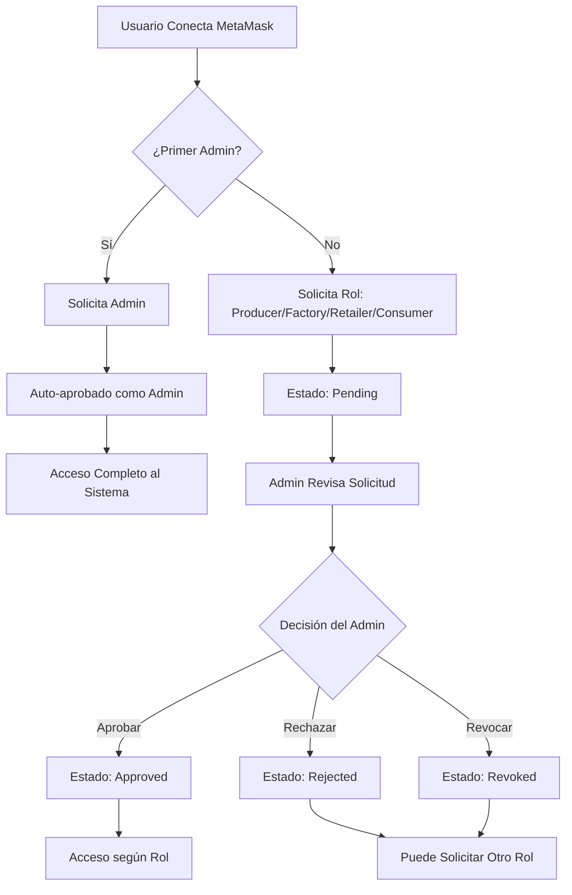
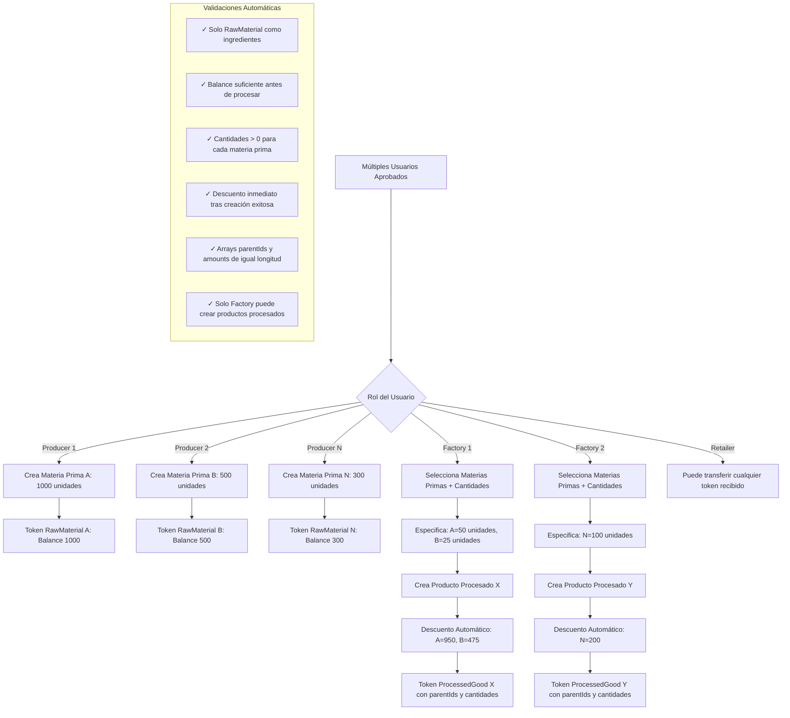
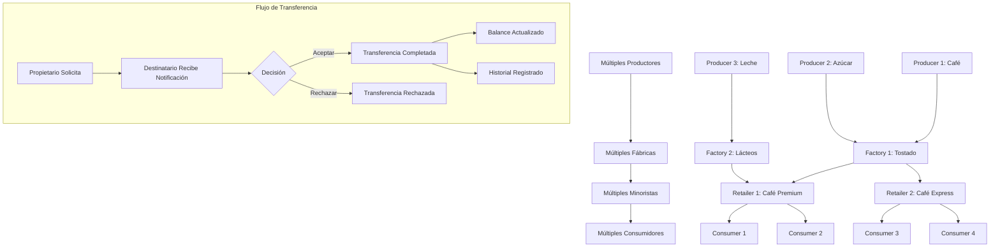
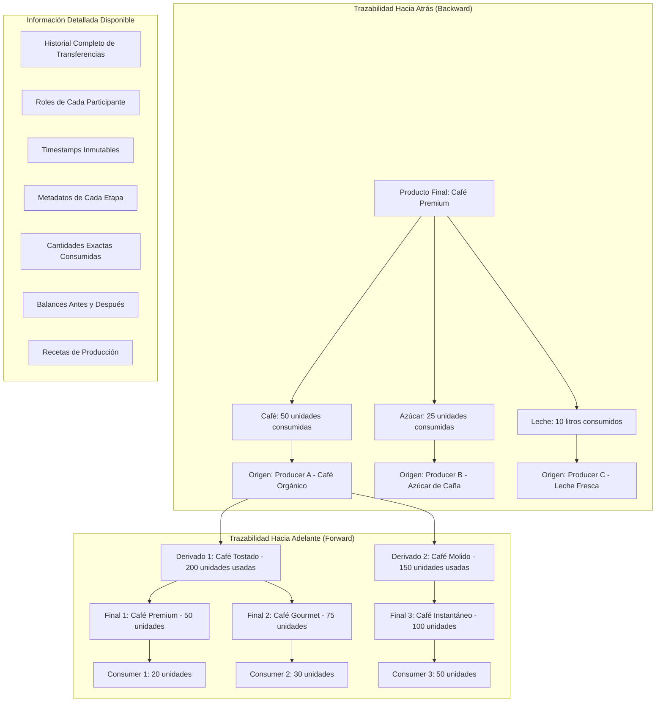
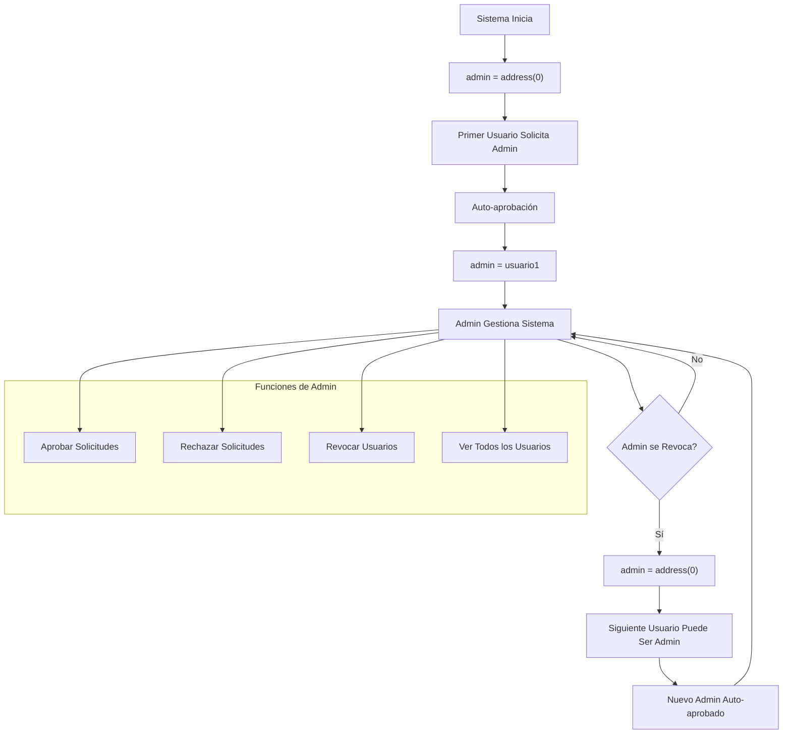

# 🔗 Trazabilidad de Productos con Blockchain

**Proyecto de Ricardo Vögeli – GitHub: [@risuiar](https://github.com/risuiar)**  
**Sitio:** <codecrypto.academy/>

Aplicación descentralizada para rastrear productos desde su origen hasta el consumidor final, garantizando transparencia y trazabilidad completa en toda la cadena de suministro.

## 📖 ¿Qué hace esta aplicación?

Permite que diferentes actores de una cadena de suministro (productores, fábricas, minoristas y consumidores) registren y transfieran productos de forma transparente usando tecnología blockchain. Cada producto tiene un historial completo e inmutable que puede ser verificado por cualquier persona.

### 🎯 Roles en la Cadena

| Rol | Descripción | Puede Hacer |
|-----|-------------|-------------|
| **🌾 Productor** | Origen de materias primas | Crear materias primas y enviar a fábricas |
| **🏭 Fábrica** | Procesa materias primas | Transformar materias primas en productos y enviar a minoristas |
| **🏪 Minorista** | Distribuye productos | Recibir productos y distribuir a consumidores |
| **🛒 Consumidor** | Usuario final | Recibir y verificar productos finales |
| **👨‍💼 Administrador** | Gestiona el sistema | Aprobar/rechazar solicitudes de roles y revocar accesos |

## ✨ Funcionalidades Principales

### 🆕 Sistema de Roles con Control Total

- **Solicitud de Roles**: Cualquier usuario puede solicitar un rol en el sistema
- **Múltiples Usuarios por Rol**: Soporte para múltiples productores, fábricas, minoristas y consumidores
- **Admin Dinámico**: El primer usuario en solicitar Admin se convierte en administrador
- **Gestión Independiente**: Los usuarios pueden cancelar sus propias solicitudes pendientes
- **Validaciones Inteligentes**: 
  - No puedes solicitar otro rol si ya tienes uno aprobado
  - No puedes hacer solicitudes duplicadas
  - Solo el administrador puede aprobar/rechazar
- **Panel de Administración**: Gestión completa de solicitudes y usuarios
- **Actualizaciones en Tiempo Real**: Los cambios se reflejan automáticamente en la interfaz

### 📦 Gestión de Productos con Trazabilidad Completa

- **Creación de Productos**: Cada producto es un token ERC-1155 con información detallada
- **Consumo Inteligente de Materias Primas**: 
  - **Cantidades Específicas**: Especifica exactamente cuántas unidades de cada materia prima usar
  - **Descuento Automático**: Al crear un producto procesado, las materias primas se descuentan automáticamente del balance
  - **Validación de Balance**: El sistema verifica que tengas suficiente stock antes de procesar
  - **Solo Materias Primas**: Solo se pueden usar tokens de tipo RawMaterial como ingredientes (no productos procesados)
  - **Registro de Cantidades**: Cada producto procesado guarda las cantidades exactas consumidas de cada materia prima
- **Trazabilidad Bidireccional**: 
  - **Hacia atrás**: Desde cualquier producto hasta sus materias primas originales con cantidades exactas consumidas
  - **Hacia adelante**: Desde materias primas hasta todos los productos derivados y sus destinos finales
- **Metadatos Flexibles**: Guarda información personalizada de cada producto (JSON en metadataURI)
- **Relaciones de Parentesco**: Los productos procesados mantienen referencia completa a sus materias primas padre
- **Historial Inmutable**: Cada movimiento queda registrado permanentemente en blockchain

### 🔄 Sistema de Transferencias Inteligente

- **Solicitud de Transferencia**: Envía productos a otros actores de la cadena
- **Aprobación Requerida**: El receptor debe aceptar la transferencia antes de que se complete
- **Control de Roles Estricto**: Solo se pueden hacer transferencias válidas según tu rol en la cadena
- **Flujo Dirigido**: Producer → Factory → Retailer → Consumer (no se puede saltar niveles)
- **Seguimiento Completo**: Ve todas tus transferencias pendientes, completadas y rechazadas
- **Validaciones de Negocio**: 
  - Productores: Solo pueden transferir materias primas que crearon
  - Fábricas: Solo pueden transferir productos procesados que crearon
  - Minoristas: Pueden transferir cualquier token que posean
  - Consumidores: No pueden transferir (punto final de la cadena)
- **Prevención de Duplicados**: Solo una transferencia pendiente por token a la vez

### 🛡️ Seguridad y Transparencia

- **Blockchain Inmutable**: Ningún dato puede ser alterado una vez registrado
- **Smart Contracts Auditables**: Código verificable y transparente
- **Permisos Granulares**: Cada rol tiene permisos específicos y limitados
- **Sin Intermediarios**: Las transacciones son directas entre las partes
- **Eventos Completos**: Todos los cambios emiten eventos para trazabilidad

### 🔐 Autenticación y Persistencia de Sesión

- **Conexión con MetaMask**: Integración completa con MetaMask para autenticación Web3
- **Persistencia en localStorage**: La sesión se mantiene al recargar la página
  - Tu conexión se guarda automáticamente cuando conectas tu wallet
  - Al recargar, la aplicación restaura tu sesión si la cuenta sigue disponible en MetaMask
- **Desconexión Limpia**: Al desconectar, todos los datos se eliminan del localStorage
- **Detección Automática de Cambios**: 
  - Si cambias de cuenta en MetaMask, la aplicación se actualiza automáticamente
  - Si desconectas en MetaMask, la aplicación también se desconecta
  - Cambios de red detectados y manejo automático

## 🔄 Flujos de Trabajo Mejorados

### 1. **Registro de Usuario (Soporte Múltiple)**



### 2. **Creación de Token con Consumo Automático de Materias Primas**



### 3. **Transferencia en Cadena Multi-Actor**



### 4. **Trazabilidad Completa con Cantidades Específicas**



### 5. **Gestión de Admin Dinámico**



## 🚀 Inicio Rápido

### Requisitos Previos

- **Node.js** v18 o superior ([Descargar](https://nodejs.org/))
- **Foundry** (herramientas blockchain) ([Instalación](https://book.getfoundry.sh/getting-started/installation))
- **MetaMask** (extensión de navegador) ([Descargar](https://metamask.io/))

### Instalación

```bash
# 1. Clonar el repositorio
git clone <repo-url>
cd supply-chain-tracker

# 2. Instalar dependencias del frontend
cd web
npm install
cd ..
```

### Ejecutar la Aplicación

#### Paso 1: Iniciar Blockchain Local

En una terminal:

```bash
anvil
```

✅ Debe mostrar: `Listening on 127.0.0.1:8545`

**⚠️ IMPORTANTE: Deja esta terminal abierta todo el tiempo**

#### Paso 2: Desplegar Contratos

En otra terminal:

**En Windows:**
```bash
deploy-windows.bat
```

**En Mac/Linux:**
```bash
./deploy-mac.sh
```

*(La primera vez en Mac/Linux ejecuta: `chmod +x deploy-mac.sh`)*

**📋 El script mostrará las variables listas para copiar:**

```
========================================
  Variables para web\.env
========================================

VITE_ROLE_MANAGER_ADDRESS_ANVIL=0xCf7E...0Fc9
VITE_TOKEN_FACTORY_ADDRESS_ANVIL=0xDc64...f6C9
VITE_TRANSFER_MANAGER_ADDRESS_ANVIL=0x5FC8...5707
```

> **⚠️ Importante**: Las direcciones mostradas arriba son ejemplos. Cada vez que despliegues los contratos, obtendrás **direcciones diferentes**. Siempre copia las direcciones reales que te muestre el script de deployment.

#### Paso 2.1: Actualizar Variables de Entorno

1. **Copia las 3 líneas** de "Variables para web\.env"
2. **Pega en `web/.env`** reemplazando las direcciones existentes

**💡 Tip:** Si no tienes el archivo `.env`, cópialo desde el template: `cp web/env.local.template web/.env`

#### Paso 2.2: Cambiar entre Redes (Opcional)

Para usar Sepolia testnet en lugar de Anvil local, edita `web/.env`:

```env
VITE_NETWORK=sepolia  # Cambiar de 'anvil' a 'sepolia'
```

#### Paso 3: Iniciar Frontend

```bash
cd web
npm run dev
```

Abre en tu navegador: **http://localhost:5173**

### Configurar MetaMask

1. **Agregar Red Local**:
   - Nombre: Localhost 8545
   - RPC URL: `http://127.0.0.1:8545`
   - Chain ID: `31337`
   - Moneda: `ETH`

2. **Usar Cualquier Cuenta**:
   - Puedes usar cualquier cuenta de MetaMask
   - El **primer usuario** que solicite el rol "Administrador" se convertirá automáticamente en Admin
   - No necesitas importar ninguna cuenta específica

## 🎮 Cómo Usar la Aplicación

### Para el Primer Usuario (Convertirse en Admin)

1. **Conecta tu Wallet** → Click en "Conectar MetaMask"
2. **Solicita rol Admin** → Selecciona "Administrador" (solo disponible si no hay admin)
3. **Auto-aprobación** → Te conviertes automáticamente en administrador
4. **Acceso Completo** → Serás redirigido al panel de administración

### Para Usuarios Nuevos

1. **Conecta tu Wallet** → Click en "Conectar MetaMask"
2. **Solicita un Rol** → Elige entre Productor, Fábrica, Minorista o Consumidor
3. **Espera Aprobación** → El administrador revisará tu solicitud
4. **Accede al Sistema** → Una vez aprobado, puedes usar todas las funciones

### Para el Administrador

1. **Revisa Solicitudes** → Ve todas las solicitudes pendientes en tiempo real
2. **Aprueba o Rechaza** → Click en los botones según corresponda
3. **Gestiona Usuarios** → Revoca accesos si es necesario
4. **Nota**: Si te revocas a ti mismo, pierdes permisos de admin y otro usuario puede convertirse en admin

### Crear tu Primer Producto (Como Productor o Fábrica)

#### Como Productor (Materias Primas):
1. Ve a **"Productos"** → Click en "Crear Producto"
2. Completa la información:
   - Nombre del producto (ej: "Café Orgánico")
   - Cantidad total (ej: 1000)
   - Metadatos opcionales (ej: origen, certificaciones)
3. Confirma la transacción en MetaMask
4. ¡Listo! Tu materia prima aparecerá en "Mis Productos"

#### Como Fábrica (Productos Procesados):
1. Ve a **"Productos"** → Click en "Crear Producto"
2. Completa la información básica:
   - Nombre del producto (ej: "Café Premium Tostado")
   - Cantidad total a producir (ej: 100)
   - Metadatos opcionales (JSON con características del producto)
3. **Selecciona Materias Primas**:
   - ✅ Solo aparecerán materias primas (RawMaterial) que poseas
   - ✅ Especifica cuántas unidades usar de cada una
   - ✅ El sistema valida que tengas suficiente stock antes de procesar
   - ✅ No puedes usar productos procesados como ingredientes (solo materias primas)
4. Confirma la transacción en MetaMask
5. **Resultado automático**:
   - ✅ Se crea tu producto procesado con el suministro especificado
   - ✅ Se descuentan automáticamente las cantidades exactas de materias primas usadas
   - ✅ Se registra la "receta" con parentIds y cantidades exactas consumidas
   - ✅ El producto procesado queda vinculado permanentemente a sus materias primas origen

### Transferir Productos

1. Ve a **"Productos"** → Selecciona un producto
2. Click en **"Transferir"**
3. Selecciona:
   - Destinatario (debe tener el rol correcto)
   - Cantidad a transferir
4. El destinatario debe **aceptar** la transferencia en su panel

### Ver Trazabilidad Completa

1. Ve a **"Productos"** → Selecciona cualquier producto → Click en "Detalles"
2. **Trazabilidad Hacia Atrás (Backward)**: 
   - Ve todas las materias primas utilizadas hasta el origen
   - Muestra las cantidades exactas consumidas de cada materia prima
   - Rastrea toda la cadena hasta los productores originales
3. **Trazabilidad Hacia Adelante (Forward)**: 
   - Solo disponible para materias primas
   - Ve todos los productos derivados creados con esa materia prima
   - Muestra las cantidades utilizadas en cada producto derivado
   - Rastrea hasta los consumidores finales
4. **Historial de Transferencias**: 
   - Ve todas las transferencias completadas con timestamps exactos
   - Muestra los roles de cada participante (Producer → Factory → Retailer → Consumer)
   - Información inmutable y verificable en blockchain

## 💡 Ventajas de Usar Blockchain

### Para Productores y Fabricantes

- ✅ **Certificación de Origen**: Prueba verificable del origen de tus productos en blockchain
- ✅ **Protección de Marca**: Registro inmutable de tus productos con timestamps
- ✅ **Trazabilidad Completa**: Sigue tus productos en toda la cadena hasta el consumidor final
- ✅ **Visibilidad Forward**: Ve qué productos se crean con tus materias primas y en qué cantidades exactas
- ✅ **Control de Inventario**: Balance automático actualizado al crear productos procesados
- ✅ **Recetas Inmutables**: Las cantidades utilizadas quedan registradas permanentemente

### Para Minoristas

- ✅ **Verificación de Autenticidad**: Confirma el origen real de los productos y su cadena completa
- ✅ **Transparencia**: Muestra la trazabilidad completa a tus clientes con cantidades exactas
- ✅ **Confianza**: Productos con historial verificable e inmutable en blockchain
- ✅ **Flexibilidad**: Puede manejar productos de múltiples fábricas y transferir a múltiples consumidores
- ✅ **Información Detallada**: Acceso a metadatos, recetas y historial completo de cada producto

### Para Consumidores

- ✅ **Información Completa**: Ve el recorrido completo de tu producto desde las materias primas originales
- ✅ **Garantía de Autenticidad**: Productos verificados en blockchain con historial inmutable
- ✅ **Transparencia Total**: Información inmutable y verificable públicamente
- ✅ **Trazabilidad hasta el Origen**: Conoce exactamente de dónde viene tu producto y qué materias primas contiene
- ✅ **Cantidades Exactas**: Ve las cantidades precisas de cada ingrediente utilizado
- ✅ **Cadena Completa**: Conoce todos los actores involucrados (productor, fábrica, minorista)

### Para Todos

- 🔒 **Seguridad**: Datos inmutables y a prueba de fraudes
- 🌐 **Descentralizado**: Sin intermediarios que controlen la información
- 📊 **Transparente**: Toda la información es verificable públicamente
- 💰 **Eficiente**: Reduce costos de verificación y auditorías
- 🏢 **Escalable**: Soporte para múltiples actores por rol

## 🔑 Cuentas de Prueba (Anvil)

Para pruebas locales, Anvil proporciona cuentas pre-financiadas. Usa estas para probar diferentes roles:

| Uso Sugerido | Dirección | Private Key |
|--------------|-----------|-------------|
| **Cuenta 1** | `0xf39F...2266` | `0xac09...f80` |
| **Cuenta 2** | `0x7099...79C8` | `0x59c6...90d` |
| **Cuenta 3** | `0x3C44...93BC` | `0x5de4...65a` |
| **Cuenta 4** | `0x90F7...b906` | `0x7c85...a6` |
| **Cuenta 5** | `0x15d3...6A65` | `0x47e1...a` |

> **💡 Nota sobre Admin**: Cualquier cuenta puede convertirse en Admin. El **primer usuario** que solicite el rol "Administrador" se convertirá automáticamente en administrador del sistema. No hay una cuenta predeterminada para Admin.

### Cómo Importar Cuentas en MetaMask

1. Abre MetaMask → Click en el ícono de cuenta (arriba derecha)
2. Click en **"Importar cuenta"** o **"Import Account"**
3. Pega la **Private Key** de la tabla
4. Click en **"Importar"**

### Cómo Cambiar de Cuenta

Tienes dos opciones para cambiar de cuenta:

**Opción 1: Cambio Automático**
1. Cambia a la cuenta deseada directamente en MetaMask
2. La aplicación detectará el cambio automáticamente y se actualizará

**Opción 2: Desconexión Manual**
1. Click en **"Desconectar"** en la aplicación
2. Cambia a la cuenta deseada en MetaMask
3. Click en **"Conectar MetaMask"** nuevamente

**💡 Nota sobre Persistencia:**
- Si recargas la página, tu sesión se restaurará automáticamente si la cuenta sigue disponible en MetaMask
- Al desconectar manualmente, la sesión no se restaurará al recargar (para mayor seguridad)

## 🐛 Problemas Comunes y Soluciones

### ❌ "Error: El contrato no está desplegado en esta red"

**Solución:**
1. Verifica que Anvil esté corriendo
2. Vuelve a desplegar los contratos:
   - Windows: `deploy-windows.bat`
   - Mac/Linux: `./deploy-mac.sh`
3. Actualiza las direcciones en `web/.env`
4. Reinicia el frontend (Ctrl+C y `npm run dev` de nuevo)

### ❌ "Ya tienes un rol aprobado"

**Explicación:** No puedes solicitar otro rol si ya tienes uno aprobado. Esto es por diseño para mantener la integridad de la cadena de suministro.

### ❌ "Ya tienes una solicitud pendiente"

**Solución:** Puedes cancelar tu solicitud pendiente usando el botón "Cancelar Solicitud" y luego solicitar otro rol.

### ❌ MetaMask no muestra las transacciones

**Solución:**
1. En MetaMask → Configuración → Avanzado
2. Click en "Clear activity tab data" o "Reset account"
3. Esto limpiará el cache de transacciones

### ❌ "Nonce too high"

**Solución:** Reset MetaMask (Configuración → Avanzado → Clear activity tab data)

## 🛠️ Tecnologías Utilizadas (Stack)

- **Blockchain (Backend)**: Solidity 0.8.20 con Foundry (incluye tests de contratos)
- **Frontend**: React 18 + TypeScript + Vite
  - **Testing**: Vitest
  - **Calidad de Código**: Configurado con ESLint y Prettier (pre-commit hooks)
- **Estilos**: Tailwind CSS
- **Web3**: ethers.js v6
- **Notificaciones**: react-hot-toast

## 🌐 Deployment en Testnets (Sepolia, etc.)

> **⚠️ Nota**: Para ver el intento de despliegue en Sepolia (no funcional), consulte [README_testnet.md](./README_testnet.md).

## 📚 Documentación Técnica

Para desarrolladores que quieran entender el código en detalle:

- **[README_SPECS.md](./README_SPECS.md)**: Instrucciones y requerimientos del curso para la creación de este proyecto.

## 🎯 Flujo de Prueba Completo Multi-Usuario

Sigue estos pasos para probar todas las funcionalidades con múltiples usuarios:

### 1. Configura el Sistema

1. **Inicia Anvil** → Terminal 1: `anvil`
2. **Despliega Contratos** → Terminal 2: Script según tu sistema operativo
3. **Actualiza Direcciones** → En `web/.env`
4. **Inicia Frontend** → Terminal 3: `cd web && npm run dev`

### 2. Como Primer Usuario (Admin)

1. **Conecta con cualquier cuenta** → Solicita rol "Administrador"
2. **Auto-aprobación** → Te conviertes automáticamente en admin
3. **Panel de Administración** → Acceso completo al sistema

### 3. Como Múltiples Productores (Cuentas 2, 3, 4)

1. **Productor A** (Cuenta 2):
   - Solicita rol "Productor" → Admin aprueba
   - Crea "Café Premium, 1000 unidades"
   - Crea "Azúcar Orgánica, 500 unidades"

2. **Productor B** (Cuenta 3):
   - Solicita rol "Productor" → Admin aprueba
   - Crea "Leche Fresca, 2000 litros"
   - Crea "Cacao Premium, 300 kg"

3. **Productor C** (Cuenta 4):
   - Solicita rol "Productor" → Admin aprueba
   - Crea "Vainilla Natural, 100 unidades"

### 4. Como Múltiples Fábricas (Cuentas 5, 6)

1. **Fábrica A** (Cuenta 5):
   - Solicita rol "Fábrica" → Admin aprueba
   - Recibe café (500 unidades) y azúcar (200 unidades) de Productor A
   - Crea "Café Endulzado Premium, 150 unidades" especificando:
     - Café Premium: 100 unidades (de las 500 disponibles)
     - Azúcar Orgánica: 50 unidades (de las 200 disponibles)
   - **Resultado**: Balances actualizados automáticamente (Café=400, Azúcar=150)
   - **Trazabilidad**: El producto final muestra ambos orígenes con cantidades exactas consumidas

2. **Fábrica B** (Cuenta 6):
   - Solicita rol "Fábrica" → Admin aprueba
   - Recibe leche (1000 litros), cacao (150 kg) y vainilla (50 unidades) de Productores B y C
   - Crea "Chocolate con Leche Artesanal, 200 unidades" especificando:
     - Leche: 200 litros (de las 1000 disponibles)
     - Cacao: 75 kg (de los 150 disponibles)
     - Vainilla: 25 unidades (de las 50 disponibles)
   - **Resultado**: Balances actualizados automáticamente (Leche=800, Cacao=75, Vainilla=25)
   - **Trazabilidad**: El chocolate queda vinculado permanentemente a las 3 materias primas con cantidades exactas

### 5. Como Múltiples Minoristas (Cuentas 7, 8)

1. **Minorista A** (Cuenta 7):
   - Solicita rol "Minorista" → Admin aprueba
   - Recibe productos de ambas fábricas
   - Puede transferir a múltiples consumidores

2. **Minorista B** (Cuenta 8):
   - Solicita rol "Minorista" → Admin aprueba
   - Recibe productos de Fábrica A
   - Especializado en productos de café

### 6. Como Múltiples Consumidores (Cuentas 9, 10)

1. **Consumidor A** (Cuenta 9):
   - Solicita rol "Consumidor" → Admin aprueba
   - Recibe "Café Endulzado Premium"
   - **Ve trazabilidad completa con cantidades**: 
     - Café: 100 unidades (Productor A) 
     - Azúcar: 50 unidades (Productor A) 
     - → Fábrica A → Minorista A

2. **Consumidor B** (Cuenta 10):
   - Solicita rol "Consumidor" → Admin aprueba
   - Recibe "Chocolate con Leche Artesanal"
   - **Ve trazabilidad completa con cantidades**: 
     - Leche: 200 litros (Productor B)
     - Cacao: 75 kg (Productor B) 
     - Vainilla: 25 unidades (Productor C) 
     - → Fábrica B → Minorista A

### 7. Verificar Trazabilidad Bidireccional

1. **Desde Consumidor** (Backward Traceability):
   - Ve el producto final y rastrea hasta todas las materias primas originales
   - Ve todos los actores involucrados con timestamps

2. **Desde Productor** (Forward Traceability):
   - Productor A puede ver que su café se usó en "Café Endulzado Premium"
   - Puede ver que llegó hasta Consumidor A
   - Ve toda la cadena hacia adelante

### 8. Gestión de Admin

1. **Revocar Usuario**: Admin revoca a un usuario problemático
2. **Auto-revocación**: Admin se revoca a sí mismo
3. **Nuevo Admin**: Otro usuario puede convertirse en admin
4. **Continuidad**: El sistema sigue funcionando sin interrupciones

---

## 🤝 Contribuir

¿Encontraste un bug o tienes una sugerencia? ¡Abre un issue o envía un pull request!

---

**Nota**: Esta aplicación está configurada para desarrollo local y testnet. El sistema soporta múltiples usuarios por rol, admin dinámico, y trazabilidad bidireccional completa, haciendo que sea más cercano a un escenario real de cadena de suministro.